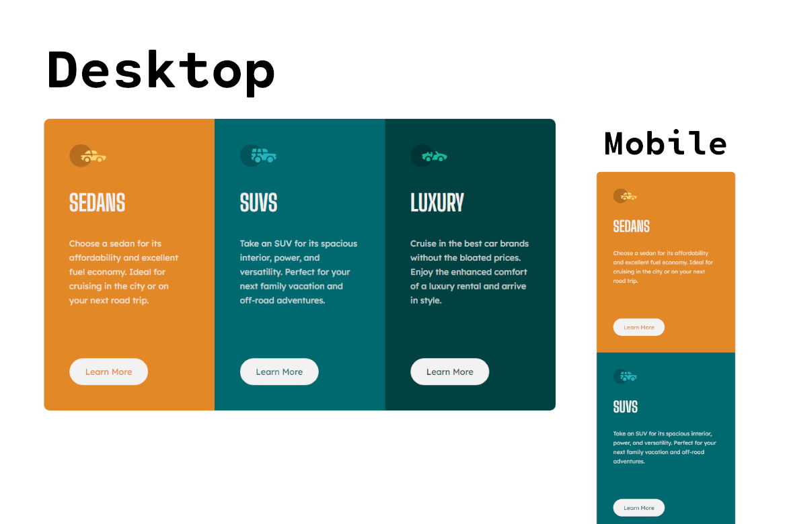

# Frontend Mentor - 3-column preview card component solution

This is a solution to the [3-column preview card component challenge on Frontend Mentor](https://www.frontendmentor.io/challenges/3column-preview-card-component-pH92eAR2-). Frontend Mentor challenges help you improve your coding skills by building realistic projects. 

## Table of contents

- [Overview](#overview)
  - [Screenshot](#screenshot)
  - [Links](#links)
- [My process](#my-process)
  - [Built with](#built-with)
  - [What I learned](#what-i-learned)
  - [Continued development](#continued-development)
  - [Useful resources](#useful-resources)
- [Author](#author)
- [Acknowledgments](#acknowledgments)

**Note: Delete this note and update the table of contents based on what sections you keep.**

## Overview

For this project I mainly used vanilla HTML with SASS as my CSS framework/tool, I also used some additional sites listed on the Useful Resources section. **Note: the screenshot was made using GIMP**.

### Screenshot



### Links

- Solution URL: [Github](https://github.com/covolan/frontend-mentor/tree/main/3-column-preview-card-component-main)
- Live Site URL: [Page](https://covolan.github.io/frontend-mentor1/3-column-preview-card-component-main/index.html)

## My process

### Built with

- Semantic HTML5 markup
- SASS
- Mobilie responsive layout

### What I learned

My initial thought was nesting the provided text with two divs, one for the use of grid display and the others for each of the columns of the grid. Gave the title a tag of h1 and the text paragraph tag, created a button and added the privided icon aswell. Each of the images was included with a alt and de cards-div the role main.

```html
<div class="cards-div" role="main">
    <div class="card sedans">
      
      <h1>Sedans</h1>
      <p>
        Choose a sedan for its affordability and excellent fuel economy. Ideal for cruising in the city
        or on your next road trip.
      </p>
      <button class="btn-learn-more sedans-btn">Learn More</button>
    </div>
    ...
```

Next, I adjusted the attribution privided giving it a complementary role and added the link to the google fonts provided.

```html
<link rel="preconnect" href="https://fonts.googleapis.com">
<link rel="preconnect" href="https://fonts.gstatic.com" crossorigin>
<link href="https://fonts.googleapis.com/css2?family=Big+Shoulders+Display:wght@700&family=Lexend+Deca&display=swap"
  rel="stylesheet">
  
  ...

<div class="attribution" role="complementary">
  Challenge by <a href="https://www.frontendmentor.io?ref=challenge" target="_blank">Frontend Mentor</a>.
  Coded by <a href="https://www.frontendmentor.io/profile/covolan" target="_blank">Covolan</a>.
</div>
```

The next step was creating the SASS initial file. Then added the colors as variables and some comments. I setted the initial conditions of the page.

```scss
$bright-orange: hsl(31, 77%, 52%);
$dark-cyan: hsl(184, 100%, 22%);
$very-dark-cyan: hsl(179, 100%, 13%);
// (paragraphs)
$transparent-white: hsla(0, 0%, 100%, 0.75);
// (background, headings, buttons)
$very-light-gray: hsl(0, 0%, 95%);

$visu: 1px solid black;
$visu2: 1px solid red;

// Font size: 15px
// Mobile: 375px
// Desktop: 1440px

// SETTING INITIAL CONDITIONS

* {
    margin: 0;
    padding: 0;
    box-sizing: border-box;
}
```

Next I adjusted the body to a grid layout, that because of the footed provided from FrontEnd Mentor, that way the main content is on the center-ish  of the page while the footer is on te bottom. Created also the main div for the cards, giving it a template of 3 columns and setted height, gave it a max width for larger displays aswell, justifying this div on center made so it could be on the center of the column in the grid display.

```scss
body {
    display: grid;
    grid-template-columns: 1fr;
    align-items: end;
    height: 100svh;
}

// CARDS

.cards-div {
    display: grid;
    grid-template-columns: 1fr 1fr 1fr;
    max-width: 900px;
    min-height: 500px;
    justify-self: center;
}

```

After that I fine tunned the cards to look similar to the provided exemple. **Ps: I don't know why but SASS is giving the :hover part a space when compiled into CSS, so be aware when compiling yourself**.

```scss
.card {
    padding: 45px;
    p {
        font-size: 15px;
        font-family: 'Lexend Deca', sans-serif;
        line-height: 25px;
        color: $transparent-white;
        font-weight: 400;
    }

    h1 {
        font-family: 'Big Shoulders Display', cursive;
        text-transform: uppercase;
        font-weight: 700;
        font-size: 40px;
        margin: 35px 0;
        color: $very-light-gray;
    }
}

.btn-learn-more {
    font-family: 'Lexend Deca', sans-serif;
    font-size: 15px;
    margin-top: 90px;
    background-color: $very-light-gray;
    padding: 14px 28px;
    border: none;
    border-radius: 25px;
    transition: ease-in-out 0.3s;

    :hover {
        background-color: $transparent-white;
        cursor: pointer;
    }
}

```

The next step was giving each background and button its color, and the border radius also.

```scss

.sedans {
    background-color: $bright-orange;
    border-radius: 10px 0px 0px 10px;
}

.suvs {
    background-color: $dark-cyan;
}

.luxury {
    background-color: $very-dark-cyan;
    border-radius: 0px 10px 10px 0px;
}

.sedans-btn {
    color: $bright-orange;
}

.suvs-btn {
    color: $dark-cyan;
}

.luxury-btn {
    color: $very-dark-cyan;
}
```

Then I adjusted the footed provided style a bit to fit the content.

```scss

// FOOTER PROVIDED

.attribution {
    font-size: 11px;
    text-align: center;
    font-family: 'Lexend Deca', sans-serif;
    margin: 20px;
}

.attribution a {
    color: hsl(228, 45%, 44%);
}
```

Next part took a little bit of testing on the debug screen on the web browser, I tried making as responsive as possible for every device. Eventually I want to explore the mobile first approach, but this project was made with the desktop first approach.

```scss
// MEDIA CONTENT 

@media screen and (max-width: 768px) and (min-width: 529px) {
    .cards-div {
        scale: 0.9;
    }

    .card {
        padding: 20px;
        text-align: center;
    }
}

@media screen and (max-width: 530px) {
    .body {
        height: 100svh;
    }

    .cards-div {
        grid-template-columns: 1fr;
        min-height: unset;
    }

    .cards-div {
        max-width: unset;
        min-height: unset;
        scale: 0.8;
    }

    .sedans {
        border-radius: 10px 10px 0 0;
    }

    .luxury {
        border-radius: 0px 0 10px 10px;
    }

}
```


### Continued development

For future responsive projects I want to try the mobile first approach to see the difference in production and the final result.

### Useful resources

- [SASS Documentation](https://sass-lang.com/documentation/) - I used the SASS documentation when utilizing the tool.
- [ARIA practices](https://www.w3.org/WAI/ARIA/apg/patterns/landmarks/examples/general-principles.html) - Used this website to guide me through the ARIA best practices.

## Author

- Github - [Covolan](https://github.com/covolan)
- Frontend Mentor - [@Covolan](https://www.frontendmentor.io/profile/covolan)
- LinkedIn - [@alexandre-covolan](https://www.linkedin.com/in/alexandre-covolan/)

## Acknowledgments

This project helped me to use SASS, ARIA best practices, grid responsive layout and scale on the media responsive layout.
