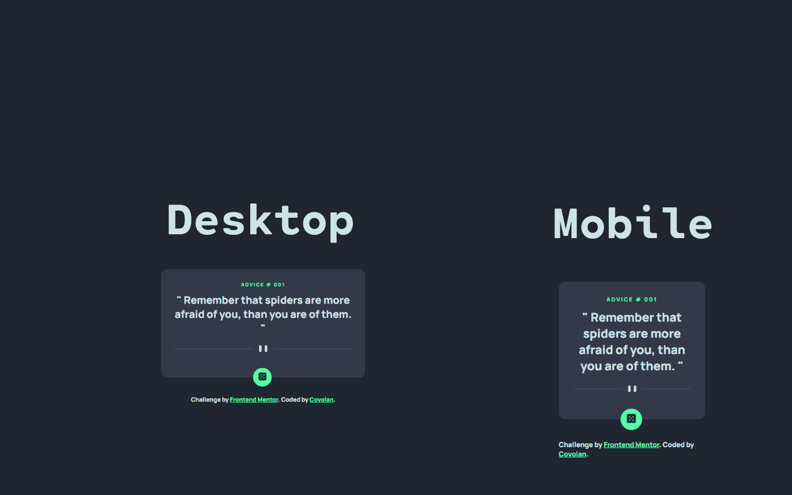

# Frontend Mentor - Advice generator app solution

This is a solution to the [Advice generator app challenge on Frontend Mentor](https://www.frontendmentor.io/challenges/advice-generator-app-QdUG-13db). Frontend Mentor challenges help you improve your coding skills by building realistic projects.

## Table of contents

- [Overview](#overview)
  - [Screenshot](#screenshot)
  - [Links](#links)
- [My process](#my-process)
  - [Built with](#built-with)
  - [What I learned](#what-i-learned)
- [Author](#author)

## Overview

### Screenshot



### Links

- Solution URL: [Github](https://github.com/covolan/frontend-mentor1/edit/main/advice-generator-app-main/)
- Live Site URL: [Page](https://covolan.github.io/frontend-mentor1/advice-generator-app-main/)

## My process

### Built with

- Semantic HTML5 markup
- SCSS
- Vanilla JavaScript

### What I learned


Overall a pretty straight foward challenge. Simplistic css and easy html to handle. The JS part was a bit more complicated as I never worked with fetch and API's before in JavaScript, but with some documentation reading ended up solving it.

I used query selectors to get the elements, created a async function to fetch the data from the provided url, then passed the advice and the id to the document when the button is clicked.

```js
const url = "https://api.adviceslip.com/advice";
const adviceId = document.querySelector(".advice__id");
const adviceText = document.querySelector(".advice");
const button = document.querySelector(".random__btn");

async function getAdvice() {
  const response = await fetch(url);
  let data = await response.json();
  adviceText.innerHTML = data.slip.advice;
  adviceId.innerHTML = data.slip.id;
}

button.addEventListener("click", getAdvice);
```

## Author

- Github - [Covolan](https://github.com/covolan)
- Frontend Mentor - [@Covolan](https://www.frontendmentor.io/profile/covolan)
- LinkedIn - [@alexandre-covolan](https://www.linkedin.com/in/alexandre-covolan/)
