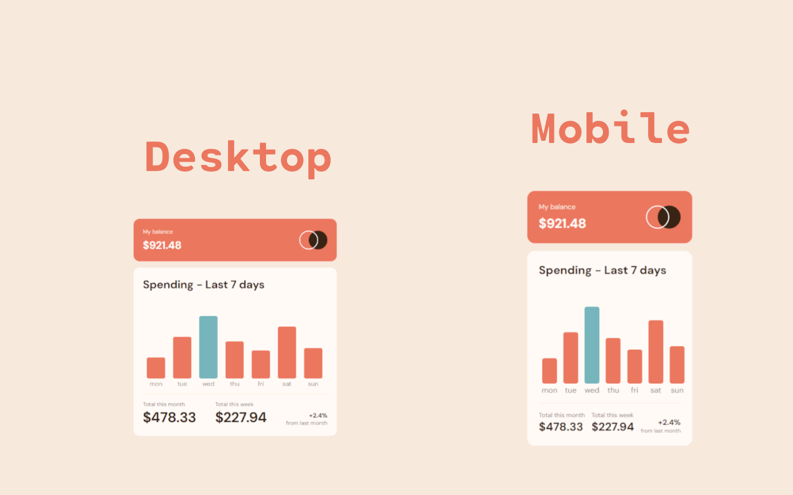

# Frontend Mentor - Expenses chart component solution

This is a solution to the [Expenses chart component challenge on Frontend Mentor](https://www.frontendmentor.io/challenges/expenses-chart-component-e7yJBUdjwt). Frontend Mentor challenges help you improve your coding skills by building realistic projects. 

## Table of contents

- [Overview](#overview)
  - [Screenshot](#screenshot)
  - [Links](#links)
- [My process](#my-process)
  - [Built with](#built-with)
  - [What I learned](#what-i-learned)
- [Author](#author)

## Overview

### Screenshot

### Links

- Solution URL: [Github](https://your-solution-url.com)
- Live Site URL: [Page](https://your-live-site-url.com)

## My process

### Built with

- Semantic HTML5 markup
- SCSS
- React

### What I learned

Overall a quite fun challenge, I'm currently learning React so the code may seems a little messy still. I faced a problem with useState from react and asked for help in the discord comunity, Josh Burri and Unidade helped me out with this.

## Author

- Github - [Covolan](https://github.com/covolan)
- Frontend Mentor - [@Covolan](https://www.frontendmentor.io/profile/covolan)
- LinkedIn - [@alexandre-covolan](https://www.linkedin.com/in/alexandre-covolan/)