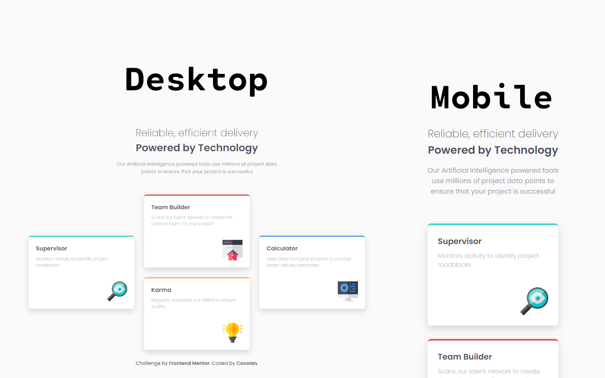

# Frontend Mentor - Four card feature section solution

This is a solution to the [Four card feature section challenge on Frontend Mentor](https://www.frontendmentor.io/challenges/four-card-feature-section-weK1eFYK). Frontend Mentor challenges help you improve your coding skills by building realistic projects.

## Table of contents

- [Overview](#overview)
  - [Screenshot](#screenshot)
  - [Links](#links)
- [My process](#my-process)
  - [Built with](#built-with)
  - [What I learned and thought process](#what-i-learned-and-thought-process)
  - [Continued development](#continued-development)
- [Author](#author)

## Overview

### Screenshot



### Links

- Solution URL: [GitHub](https://github.com/covolan/frontend-mentor3/tree/main/four-card-feature-section-master)
- Live Site URL: [Vercel](https://four-card-feature-covolan.vercel.app/)

## My process

### Built with

- Semantic HTML5 markup
- SASS

### What I learned and thought process

The first step as aways was adjust the markdown part, giving it semantic meaning and trying to make as accessible as possible.

```html
<body>
  <main class="main">
    <div class="header-container">
      <h1>Reliable, efficient delivery</h1>
      <h2>Powered by Technology</h2>

      <p id="description">
        Our Artificial Intelligence powered tools use millions of project data
        points to ensure that your project is successful
      </p>
    </div>

    <div class="content-container">
      <div class="card supervisor">
        <p class="card-title">Supervisor</p>
        <p>Monitors activity to identify project roadblocks</p>
        
      </div>

      <div class="middle-column">
        <div class="card team-builder">
          <p class="card-title">Team Builder</p>
          <p>
            Scans our talent network to create the optimal team for your project
          </p>
          
        </div>
        <div class="card karma">
          <p class="card-title">Karma</p>
          <p>Regularly evaluates our talent to ensure quality</p>
          
        </div>
      </div>

      <div class="card calculator">
        <p class="card-title">Calculator</p>
        <p>Uses data from past projects to provide better delivery estimates</p>
        
      </div>
    </div>
  </main>

  <footer>
    <p class="attribution">
      Challenge by
      <a href="https://www.frontendmentor.io?ref=challenge" target="_blank"
        >Frontend Mentor</a
      >. Coded by
      <a href="https://www.frontendmentor.io/profile/covolan" target="_blank"
        >Covolan</a
      >.
    </p>
  </footer>
</body>
```

Starting the scss file creating the color variables, importing the font, setting some proprieties for the document and adjusting the background to properly center the content.

```scss
// - Mobile: 375px
// - Desktop: 1440px

@import url("https://fonts.googleapis.com/css2?family=Poppins:wght@200;400;600&display=swap");

$red: hsl(0, 78%, 62%);
$cyan: hsl(180, 62%, 55%);
$orange: hsl(34, 97%, 64%);
$blue: hsl(212, 86%, 64%);

$very-dark-blue: hsl(234, 12%, 34%);
$grayish-blue: hsl(229, 6%, 66%);
$very-light-gray: hsl(0, 0%, 98%);

* {
  margin: 0;
  padding: 0;
  box-sizing: border-box;
  font-family: "Poppins", sans-serif;
}

body {
  text-align: center;
  min-height: 100vh;
  background-color: $very-light-gray;
  display: flex;
  flex-direction: column;
  justify-content: center;
  align-items: center;
}
```

Then properly adjust the container that has the heading and some information, following that, ajusted the content container to center the content and gave it proper margin and gap between the cards. Created the middle column aswell. My approach was using flex to match the design.

```scss
.header-container {
  display: flex;
  flex-direction: column;
  justify-content: center;
  color: $very-dark-blue;
  margin: 3em 1.5em;

  h1 {
    font-size: 2.1em;
    font-weight: 200;
  }

  h2 {
    font-size: 2.1em;
  }

  p {
    color: $grayish-blue;
    max-width: 35em;
    align-self: center;
    margin: 1em 0;
  }
}

.content-container {
  margin-top: 3em;
  display: flex;
  align-items: center;
  justify-content: center;
  gap: 2em;
  margin: 2em;

  .middle-column {
    display: flex;
    flex-direction: column;
    gap: 2em;
  }
}
```

Next I started to work con the cards, trying to match as much as possible the design. Pretty straight foward.

```scss
.card {
  display: flex;
  flex-direction: column;
  background-color: white;
  text-align: left;
  box-shadow: 0 8px 20px hsla(234, 12%, 34%, 0.212);
  padding: 1.5em;
  max-width: 22em;
  min-height: 15em;
  border-radius: 0.5em;

  .card-title {
    font-size: 1.2em;
    color: $very-dark-blue;
    font-weight: 600;
    margin-bottom: 0.5em;
  }

  p {
    margin-bottom: 3em;
    color: $grayish-blue;
    font-weight: 200;
    font-size: 0.9em;
  }

  img {
    width: 4.2em;
    align-self: flex-end;
    margin-top: auto;
  }
}
```

To match the design I gave each card a propper border color, probably could be done with SASS loop feature, but as there are only 4 cards I figured that doing manually would be faster.

```scss
.supervisor {
  border-top: 0.3em solid $cyan;
}

.team-builder {
  border-top: 0.3em solid $red;
}

.calculator {
  border-top: 0.3em solid $blue;
}

.karma {
  border-top: 0.3em solid $orange;
}
```

The final step on the design was stylish the provided footer to match the design of the document.

```scss
.attribution {
  font-size: 1em;
  text-align: center;
  margin-bottom: 2em;
}

.attribution a {
  color: $very-dark-blue;
  text-decoration: none;
  font-weight: 600;
  cursor: pointer;
}
```

And Finally the media queries, adjusted for responsiveness.

```scss
@media screen and (max-width: 1120px) and (min-width: 745px) {
  .card {
    max-width: unset;
    width: 40em;
  }
}

@media screen and (max-width: 1120px) {
  .content-container {
    flex-direction: column;
  }

  .header-container {
    h1 {
      font-size: 1.6em;
    }

    h2 {
      font-size: 1.6em;
    }
  }
}
```

### Continued development

I could have done this with grid method, but didn't find a easy way to propperly apply it. So one idea is try to make the design again but with grid.

## Author

- Github - [Covolan](https://github.com/covolan)
- Frontend Mentor - [@Covolan](https://www.frontendmentor.io/profile/covolan)
- LinkedIn - [@alexandre-covolan](https://www.linkedin.com/in/alexandre-covolan/)
