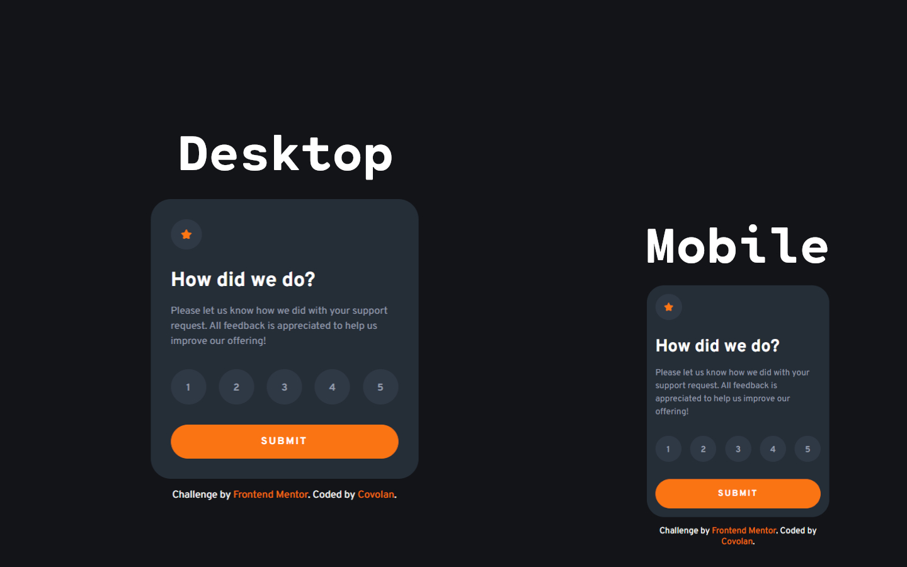

# Frontend Mentor - Interactive rating component solution

This is a solution to the [Interactive rating component challenge on Frontend Mentor](https://www.frontendmentor.io/challenges/interactive-rating-component-koxpeBUmI). Frontend Mentor challenges help you improve your coding skills by building realistic projects.

## Table of contents

- [Overview](#overview)
  - [Screenshot](#screenshot)
  - [Links](#links)
- [My process](#my-process)
  - [Built with](#built-with)
  - [What I learned](#what-i-learned)
- [Author](#author)

## Overview

### Screenshot



### Links

- Solution URL: [Add solution URL here](https://your-solution-url.com)
- Live Site URL: [Add live site URL here](https://your-live-site-url.com)

## My process

### Built with

- Semantic HTML5 markup
- SCSS
- JavaScript

### What I learned

This was a quite fun project to deal with, managing the DOM its challenging for a beginner and I liked the challenge. The markup part as aways was ok to assemble, the style part took a little bit of tweaking to match the design. The JS part was challenging and fun.

I started by defining each constant to each element by its ID. Then created a function to handle the pressed state of the button, that so when another button is pressed, the one before is no longer pressed, for that I created also a clear button function that changes the style of the pressed button back to its original state. Created also a function to handle the submit action, using preventDefault to prevent the refresh of the page.

```js
const btn1 = document.getElementById("1");
const btn2 = document.getElementById("2");
const btn3 = document.getElementById("3");
const btn4 = document.getElementById("4");
const btn5 = document.getElementById("5");
const form = document.getElementById("form");

const rating = document.getElementById("rating-state");
const thank = document.getElementById("thank-state");

const number = document.getElementById("number");

let clicked = [];

function btnEvent(btn, btnNumber) {
  btn.addEventListener("click", () => {
    if (clicked.length == 0) {
      btn.style.backgroundColor = "hsl(25, 97%, 53%)";
      btn.style.color = "white";
      clicked.push(btnNumber);
    } else {
      clearButton(clicked[0]);
      btn.style.backgroundColor = "hsl(25, 97%, 53%)";
      btn.style.color = "white";
      clicked.push(btnNumber);
    }
  });
}

form.addEventListener("submit", (event) => {
  rating.style.display = "none";
  thank.style.display = "flex";
  event.preventDefault();
  if (clicked.length == 0) {
    number.innerHTML += "0";
  } else {
    number.innerHTML += clicked[0][3];
  }
});

function clearButton(btn) {
  switch (btn) {
    case "btn1":
      btn1.style.backgroundColor = "hsla(212, 20%, 37%, 0.26)";
      btn1.style.color = "hsl(217, 12%, 63%)";
      clicked.pop();
    case "btn2":
      btn2.style.backgroundColor = "hsla(212, 20%, 37%, 0.26)";
      btn2.style.color = "hsl(217, 12%, 63%)";
      clicked.pop();
    case "btn3":
      btn3.style.backgroundColor = "hsla(212, 20%, 37%, 0.26)";
      btn3.style.color = "hsl(217, 12%, 63%)";
      clicked.pop();
    case "btn4":
      btn4.style.backgroundColor = "hsla(212, 20%, 37%, 0.26)";
      btn4.style.color = "hsl(217, 12%, 63%)";
      clicked.pop();
    case "btn5":
      btn5.style.backgroundColor = "hsla(212, 20%, 37%, 0.26)";
      btn5.style.color = "hsl(217, 12%, 63%)";
      clicked.pop();
  }
}

btnEvent(btn1, "btn1");
btnEvent(btn2, "btn2");
btnEvent(btn3, "btn3");
btnEvent(btn4, "btn4");
btnEvent(btn5, "btn5");
```

## Author

- Website - [Add your name here](https://www.your-site.com)
- Frontend Mentor - [@yourusername](https://www.frontendmentor.io/profile/yourusername)
- Twitter - [@yourusername](https://www.twitter.com/yourusername)
