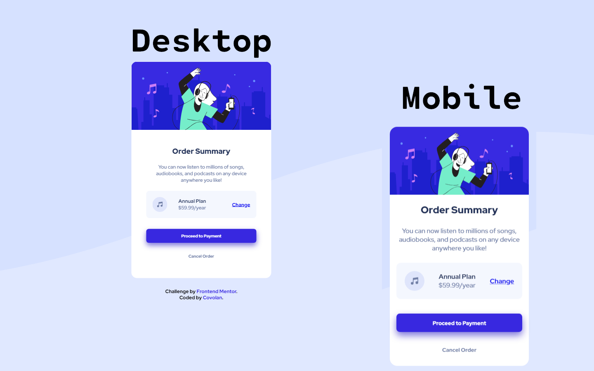

# Frontend Mentor - Order summary card solution

This is a solution to the [Order summary card challenge on Frontend Mentor](https://www.frontendmentor.io/challenges/order-summary-component-QlPmajDUj). Frontend Mentor challenges help you improve your coding skills by building realistic projects.

## Table of contents

- [Overview](#overview)
  - [Screenshot](#screenshot)
  - [Links](#links)
- [My process](#my-process)
  - [Built with](#built-with)
  - [What I learned and tought process](#what-i-learned-and-tought-process)
  - [Useful resources](#useful-resources)
- [Author](#author)
- [Acknowledgments](#acknowledgments)

**Note: Delete this note and update the table of contents based on what sections you keep.**

## Overview

### Screenshot



### Links

- Solution URL: [GitHub](https://github.com/covolan/frontend-mentor2/edit/main/order-summary-component-main)
- Live Site URL: [Page](https://covolan.github.io/frontend-mentor1/order-summary-component-main/index.html)

## My process

### Built with

- Semantic HTML5 markup
- SASS

### What I learned and tought process

I started the project doing the markup part of the document. First created a main-div for nest all the main content and gave each item a html tag accordingly to its function in the document. Starting with a div to contain the hero img, and then a article to simbolize the main content of the card, gaving description class to the paragraph that describes the product.

```html
<body>
  <div class="main-div" role="main">
    <div class="hero-img">
      
    </div>
    <article class="product-description">
      <h1>Order Summary</h1>
      <p class="description" id="description">
        You can now listen to millions of songs, audiobooks, and podcasts on any
        device anywhere you like!
      </p>
      <div class="plan-div">
        
        <p class="plan">
          <span class="plan-anual">Annual Plan</span> <br />
          <span class="price" id="price">$59.99/year</span>
        </p>
        <p class="change"><a href="#">Change</a></p>
      </div>
      <div class="btn-div">
        <button class="payment-btn" id="payment-button">
          Proceed to Payment
        </button>
        <button class="cancel-btn" id="cancel-button">Cancel Order</button>
      </div>
    </article>
  </div>

  <div class="attribution" role="complementary">
    Challenge by
    <a href="https://www.frontendmentor.io?ref=challenge" target="_blank"
      >Frontend Mentor</a
    >. Coded by
    <a href="https://www.frontendmentor.io/profile/covolan" target="_blank"
      >Covolan</a
    >.
  </div>
</body>
```

Then, after the markdown I start the scss file to style the document. Initialized the color variables and the document initial style.

```scss
// - Mobile: 375px
// - Desktop: 1440px

@import url("https://fonts.googleapis.com/css2?family=Red+Hat+Display:wght@500;700;900&display=swap");

$pale-blue: hsl(225, 100%, 94%);
$bright-blue: hsl(245, 75%, 52%);

$very-pale-blue: hsl(225, 100%, 98%);
$desaturated-blue: hsl(224, 23%, 55%);
$dark-blue: hsl(223, 47%, 23%);

// - Font size (paragraph): 1em

* {
  margin: 0;
  padding: 0;
  box-sizing: border-box;
  font-family: "Red Hat Display", sans-serif;
}
```

The next step to style the document was set the body properties in a way that it centrilizes the main-div. Then size the main div accordingly to the style provided and sized the image to fit the div.

```scss
body {
  min-height: 100vh;
  display: flex;
  flex-direction: column;
  justify-content: center;
  align-items: center;
  background: url(../images/pattern-background-desktop.svg) no-repeat
    center -300px fixed;
  background-size: cover;
  background-color: $pale-blue;
}

.main-div {
  max-width: 452px;
  max-height: 700px;
  background-color: white;
  text-align: center;
  border-radius: 1.125em;
}

.hero-img {
  img {
    min-width: 100%;
    min-height: 100%;
    border-radius: 1.125em 1.125em 0 0;
  }
}
```

The next styled part was the product desciption and the plan div, making sure to approach as much as possible the provided style. The tricky part was adjusting the plan-div components, took quite of fine tunning to do so.

```scss
.product-description {
  padding: 3em;

  h1 {
    color: $dark-blue;
    font-weight: 900;
  }

  font-size: 1em;

  .description {
    padding: 1.5625em 0;
    color: $desaturated-blue;
  }

  .plan-div {
    display: flex;
    align-items: center;
    justify-content: space-between;
    gap: 1.125em;
    background-color: $very-pale-blue;
    padding: 1.25em;
    margin-bottom: 2.1875em;
    border-radius: 0.625em;

    p:nth-child(3) {
      font-weight: 700;
    }

    .plan-anual {
      font-weight: 700;
      color: $dark-blue;
      margin-left: -3em;
    }

    .price {
      margin-left: -3em;
      color: $desaturated-blue;
    }
  }
}
```

Following along, the next styled part was the buttons, again trying to match the provided style. The catch here was making the payment-button have a superior index over the cancel-button, so that the box-shaddow woudn't appear cutted by the button.

```scss
.btn-div {
  display: flex;
  flex-direction: column;

  button {
    font-weight: 700;
    border: none;
    padding: 1em;
    border-radius: 0.625em;
    transition: 0.3s ease-in-out;
  }

  .payment-btn {
    color: white;
    background-color: $bright-blue;
    box-shadow: 0 0.625em 1.25em hsla(245, 68%, 46%, 0.63);
    z-index: 1;
  }

  .payment-btn:hover {
    background-color: hsl(245, 70%, 33%);
  }

  .cancel-btn {
    background-color: white;
    color: $desaturated-blue;
    margin-top: 1.5625em;
  }

  .cancel-btn:hover {
    background-color: rgb(234, 238, 255);
  }
}
```

Then the final part of the page style was the provided footer to mach a little the design.

```scss
.attribution {
  font-size: 1em;
  text-align: center;
  max-width: 300px;
  padding: 2em;
  font-weight: 700;
}

.attribution a {
  color: $bright-blue;
  text-decoration: none;
  cursor: pointer;
}
```

The final part of the page style was making it responsive. As a result of making the desktop layout first, this section took a little bit of twiking to became responsive to the multiple screen widths.

```scss
@media screen and (max-width: 500px) {
  .body {
    background: url(../images/pattern-background-mobile.svg);
    overflow-x: hidden;
    max-width: 100%;
  }

  .main-div {
    max-width: unset;
    max-height: unset;
    width: 90%;
  }

  .hero-img {
    img {
      width: 100%;
    }
  }

  .product-description {
    padding: 1em;

    .plan-div {
      justify-content: space-between;
      gap: unset;

      .plan-anual {
        margin-left: unset;
      }

      .price {
        margin-left: unset;
      }
    }
  }
}
```

### Useful resources

In this project I used the px to em converter [tool](https://www.w3schools.com/tags/ref_pxtoemconversion.asp) from w3schools.

## Author

- Github - [Covolan](https://github.com/covolan)
- Frontend Mentor - [@Covolan](https://www.frontendmentor.io/profile/covolan)
- LinkedIn - [@alexandre-covolan](https://www.linkedin.com/in/alexandre-covolan/)

## Acknowledgments

Overall that was a fun project. Was good to continue my learning journey with sass.
