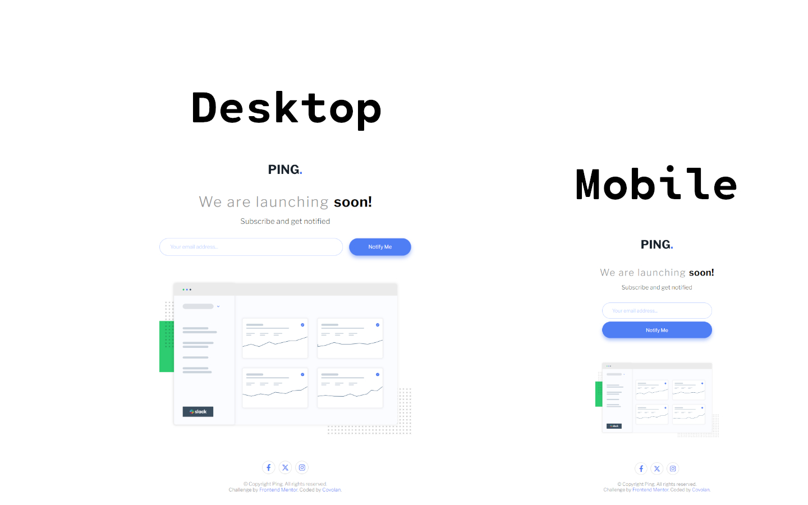

# Frontend Mentor - Ping coming soon page solution

This is a solution to the [Ping coming soon page challenge on Frontend Mentor](https://www.frontendmentor.io/challenges/ping-single-column-coming-soon-page-5cadd051fec04111f7b848da). Frontend Mentor challenges help you improve your coding skills by building realistic projects.

## Table of contents

- [Overview](#overview)
  - [Screenshot](#screenshot)
  - [Links](#links)
- [My process](#my-process)
  - [Built with](#built-with)
  - [What I learned](#what-i-learned)
- [Author](#author)

## Overview

### Screenshot



### Links

- Solution URL: [Github](https://github.com/covolan/frontend-mentor1/edit/main/ping-coming-soon-page-master/)
- Live Site URL: [Page](https://covolan.github.io/frontend-mentor1/ping-coming-soon-page-master/index.html)

## My process

### Built with

- Semantic HTML5 markup
- SCSS

### What I learned

I first started this project modifying the markup provided for semantic porpuses. Added the provided images and import the fontsawesome creating the icons for the social media. Then I started stylishing the page, pretty straight foward. I created a element with display none for the invalid email, then came the javascript part.

I then created 3 constants, one with the element of the input box for the email, one for the form itself and the last one for the error-msg element witch has the display none. Then I created a constant with a regex to validate the e-mail provided. Then created a event listener for the submit event, adding a logic that if the email is invalid change the style of the input and the error-msg, preventing the e-mail submit with preventDefault. And if the email is valid, do nothing.

```js
const emailInput = document.getElementById("email");
const form = document.getElementById("form-elem");
const errorMsg = document.getElementById("error-msg");
const myReg =
  /^[a-zA-Z0-9.!#$%&'*+/=?^_`{|}~-]+@[a-zA-Z0-9](?:[a-zA-Z0-9-]{0,61}[a-zA-Z0-9])?(?:\.[a-zA-Z0-9](?:[a-zA-Z0-9-]{0,61}[a-zA-Z0-9])?)*$/;

form.addEventListener("submit", (event) => {
  if (!myReg.test(emailInput.value)) {
    event.preventDefault();
    emailInput.style.border = "1px solid hsl(354, 100%, 66%)";
    errorMsg.style.display = "block";
  }
});
```

## Author

- Github - [Covolan](https://github.com/covolan)
- Frontend Mentor - [@Covolan](https://www.frontendmentor.io/profile/covolan)
- LinkedIn - [@alexandre-covolan](https://www.linkedin.com/in/alexandre-covolan/)
