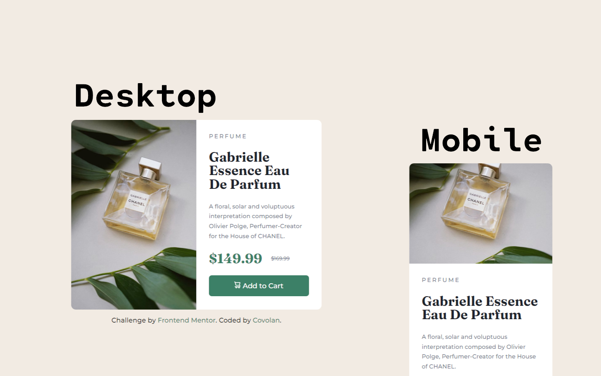

# Frontend Mentor - Product preview card component solution

This is a solution to the [Product preview card component challenge on Frontend Mentor](https://www.frontendmentor.io/challenges/product-preview-card-component-GO7UmttRfa). Frontend Mentor challenges help you improve your coding skills by building realistic projects.

## Table of contents

- [Overview](#overview)
  - [Screenshot](#screenshot)
  - [Links](#links)
- [My process](#my-process)
  - [Built with](#built-with)
  - [What I learned and tought process](#what-i-learned-and-thought-process)
- [Author](#author)

## Overview

### Screenshot



### Links

- Solution URL: [Add solution URL here](https://your-solution-url.com)
- Live Site URL: [Add live site URL here](https://your-live-site-url.com)

## My process

### Built with

- Semantic HTML5 markup
- SASS

### What I learned and thought process

Initially I modified the html to give semmantic meaning to every content, adding both images, from desktop and mobile, disabling one or another as needed.**Edit: Adjusted the content of the document to being nested by the main tag for accessibility as pointed by [@hitmorecode](https://www.frontendmentor.io/profile/hitmorecode), also changed the h1 to h2**

```html
<main class="main">
  <section class="product-image">
    
    
  </section>

  <section class="product-info">
    <p class="product-name">Perfume</p>

    <h2>Gabrielle Essence Eau De Parfum</h2>

    <p class="product-description">
      A floral, solar and voluptuous interpretation composed by Olivier Polge,
      Perfumer-Creator for the House of CHANEL.
    </p>

    <div class="price">
      <p>$149.99</p>
      <p>$169.99</p>
    </div>

    <button class="cart">
       Add
      to Cart
    </button>
  </section>
</main>
```

Then I started giving the document some style witch scss. First I added the provided colors as variables, imported the needed fonts and initialided the document with margin and paddin 0, giving box-sizing of border-box aswell. Following I made the body display flex, gave it the proprieties to center the main div and some color.

```scss
@import url("https://fonts.googleapis.com/css2?family=Fraunces:opsz,wght@9..144,700&family=Montserrat:wght@500;700&display=swap");

// font-family: 'Fraunces', serif;
// font-family: 'Montserrat', sans-serif;

$dark-cyan: hsl(158, 36%, 37%);
$cream: hsl(30, 38%, 92%);
$very-dark-blue: hsl(212, 21%, 14%);
$dark-grayish-blue: hsl(228, 12%, 48%);
$white: hsl(0, 0%, 100%);

* {
  margin: 0;
  padding: 0;
  box-sizing: border-box;
}

body {
  display: flex;
  flex-direction: column;
  justify-content: center;
  align-items: center;
  min-height: 100vh;
  background-color: $cream;
}
```

Continuing I made the mobile image not render until the media query calls it. Then made the main section have a display of grid and two columns as the template, gave it a max height and width aswell and the background color. Then adjusted the image so it would take 100% of its container.

```scss
.mobile-img {
  display: none;
}

.main {
  display: grid;
  grid-template-columns: repeat(2, 1fr);
  max-height: 28.725em;
  max-width: 37.5em;
  background-color: $white;
  border-radius: 0.7em;
  margin: 1em;

  .product-image {
    .desktop-img {
      height: 100%;
      width: 100%;
      border-radius: 0.7em 0 0 0.7em;
    }
  }
}
```

The next step was adjus the text content of the main section, pretty straight foward, just fine tunning to match the design.

```scss
.product-info {
  padding: 2.1em;
  font-family: "Montserrat", sans-serif;
  color: $dark-grayish-blue;
  font-size: 0.875em;

  .product-name {
    text-transform: uppercase;
    letter-spacing: 0.2em;
  }

  h2 {
    font-family: "Fraunces", serif;
    font-size: 2.3em;
    line-height: 1em;
    color: $very-dark-blue;
    padding: 0.8em 0;
  }

  .product-description {
    line-height: 1.7em;
  }

  .price {
    display: flex;
    gap: 1.5em;
    align-items: center;
    padding: 1.5em 0;

    p {
      font-size: 2.3em;
      font-family: "Fraunces", serif;
      color: $dark-cyan;
    }

    p:nth-child(2) {
      color: $dark-grayish-blue;
      font-family: "Montserrat", sans-serif;
      font-size: 0.875em;
      text-decoration-line: line-through;
    }
  }
}
```

The final part of the main section was stylishing the button, again just some fine tunning to match the design. Also gave the button some hover effect. **Edit: Adjusted the display and gave the icon some marging to properly match the design as pointed by [@hitmorecode](https://www.frontendmentor.io/profile/hitmorecode).**

```scss
.cart {
  display: flexbox;
  font-family: "Montserrat", sans-serif;
  font-size: 1.2em;
  padding: 0.9em;
  width: 100%;
  color: $white;
  background-color: $dark-cyan;
  border: none;
  border-radius: 0.4em;
  transition: 0.2s ease-in-out;
  cursor: pointer;

  img {
    margin-right: 0.3em;
  }
}

.cart:hover {
  background-color: hsl(158, 36%, 25%);
}
```

Then I gave the provided footer some style to match the main design.

```scss
.attribution {
  font-size: 1em;
  font-family: "Montserrat", sans-serif;
  text-align: center;
  margin: 0 2em;
}

.attribution a {
  color: $dark-cyan;
  text-decoration: none;
}
```

And finally made a media query for responsiveness to all devices. Just modifying the grid to have only one column, disabling the desktop image and adjusting the mobile one.

```scss
@media screen and (max-width: 600px) {
  .main {
    grid-template-columns: 1fr;
    max-height: unset;
    max-width: unset;

    .product-image {
      .desktop-img {
        display: none;
      }
    }
  }

  .mobile-img {
    display: block;
    width: 100%;
    height: 100%;
    border-radius: 0.7em 0.7em 0 0;
  }
}
```

## Author

- Github - [Covolan](https://github.com/covolan)
- Frontend Mentor - [@Covolan](https://www.frontendmentor.io/profile/covolan)
- LinkedIn - [@alexandre-covolan](https://www.linkedin.com/in/alexandre-covolan/)
