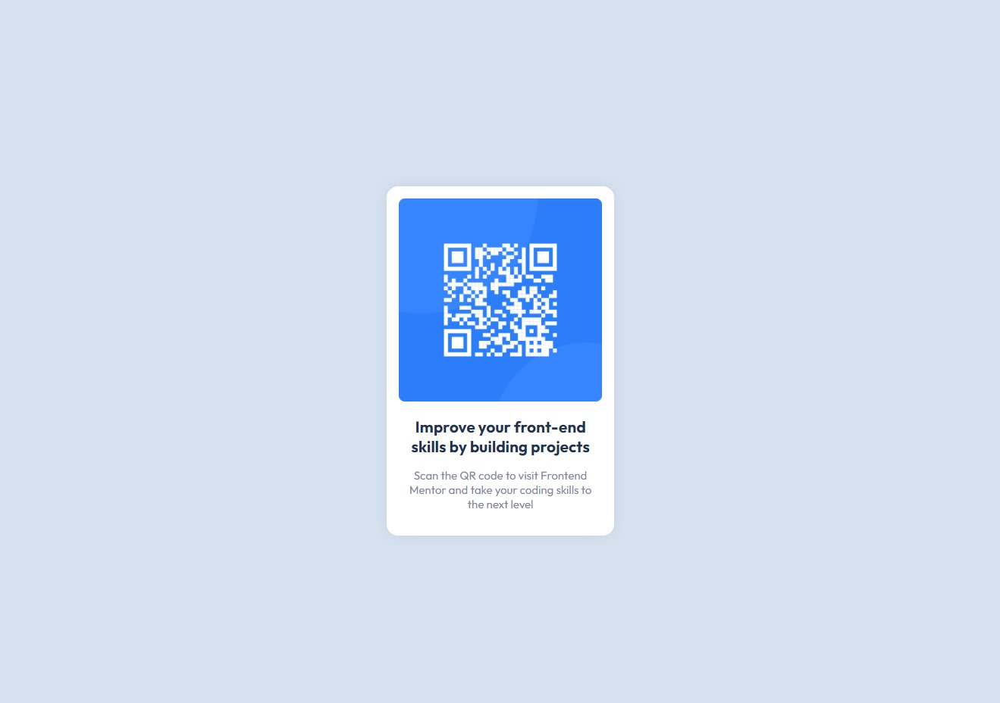

# Frontend Mentor - QR code component solution

This is a solution to the [QR code component challenge on Frontend Mentor](https://www.frontendmentor.io/challenges/qr-code-component-iux_sIO_H). Frontend Mentor challenges help you improve your coding skills by building realistic projects. 

## Table of contents

- [Overview](#overview)
  - [Screenshot](#screenshot)
  - [Links](#links)
- [My process](#my-process)
  - [Built with](#built-with)
  - [What I learned](#what-i-learned)
  - [Continued development](#continued-development)
- [Author](#author)
- [Acknowledgments](#acknowledgments)

## Overview

### Screenshot



### Links

- Solution URL: [Github](https://github.com/covolan/frontend-mentor1/edit/main/qr-code-component-main/)
- Live Site URL: [Page](https://covolan.github.io/frontend-mentor1/qr-code-component-main/index.html)

## My process

### Built with

- Semantic HTML5 markup
- CSS custom properties
- Flexbox
- Mobile layout


### What I learned and my thought process

<!-- Use this section to recap over some of your major learnings while working through this project. Writing these out and providing code samples of areas you want to highlight is a great way to reinforce your own knowledge.

To see how you can add code snippets, see below: -->

My initial thought was creating a nested div so I could center the content without relying on utilizing the body to do it. There was a number to ways to center, one exemple would be a auto margin to center the contents of the body, but that was my solution to do it.

```html
<div class="center-div">
    <div class="qr-code-div">
    </div>
</div>
```

The next step that I worked on was setting the initial CSS conditions so that I wouldn't have much difficulty aligning and spacing the contents. This was the moment that I added the provided font (using google fonts).

```css
* {
    margin: 0;
    padding: 0;
    box-sizing: border-box;
    font-family: 'Outfit', sans-serif;
}
```

```html
<link rel="preconnect" href="https://fonts.googleapis.com">
<link rel="preconnect" href="https://fonts.gstatic.com" crossorigin>
<link href="https://fonts.googleapis.com/css2?family=Outfit:wght@400;700&display=swap" rel="stylesheet">
```

Next I added the provided colors to :root so I could use variables names.

```css
:root {
    --grayish-blue: hsl(220, 15%, 55%);
    --dark-blue: hsl(218, 44%, 22%);
    --light-gray: hsl(212, 45%, 89%);
}
```

Then I added the provided qr-code image to the html document and gave the qr-code-div a width of 300px so that the image wouldn't take most of my screen. Following up I added the background color and adjusted the center div to center the contents of the page. Also made the center div take up 100vh.

```html

```

```css
body {
    background-color: var(--light-gray);
}

.center-div {
    display: flex;
    justify-content: center;
    align-items: center;
    height: 100vh;
}

.qr-code-div {
    width: 300px;
}
```

Following, I made some fine adjustments to the qr-code-div to match the provided page exemple. Also added rounded corners to the qr-code itself.

```css
.qr-code-div {
    display: flex;
    flex-direction: column;
    width: 300px;
    border-radius: 15px;
    padding: 1rem;
    background-color: white;
    box-shadow: 0 0 20px rgba(0, 0, 0, 0.068);
}

img {
    border-radius: 8px;
}
```

The final steps was adjusting the text so it look similar to the provided exemple:

```css

p,
h1 {
    text-align: center;
    padding-top: 1.2rem;
}

h1 {
    font-size: 1.3rem;
    color: var(--dark-blue);
    font-weight: 700;
}

p {
    font-size: 15px;
    padding: 1rem 0.5rem;
    font-weight: 400;
    color: var(--grayish-blue);
}
```

**Note: A buch of fine tunning was made so it match the exemple, testing and seeing what fitted my design path choices.**

Finishing up moved the provided style for the footer to the CSS file.

```css
.attribution {
    font-size: 11px;
    text-align: center;
}

.attribution a {
    color: hsl(228, 45%, 44%);
}
```

### Continued development

Some skills that I learned this project are:

- utilizing comments to guide through the project;
- use variable names to make the code cleaner;
- try to refractor the code removing redundancies;

## Author

- Github - [Covolan](https://www.your-site.com)
- Frontend Mentor - [@Covolan](https://www.frontendmentor.io/profile/covolan)
- LinkedIn - [@alexandre-covolan](https://www.linkedin.com/in/alexandre-covolan/)

## Acknowledgments

One thing that I learned is that no matter how simple the project is, if you dedicate yourself to it, you can still learn important stuff. Learning is a endless process.
