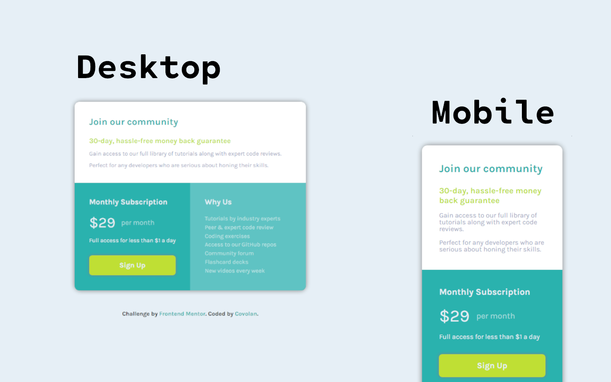

# Frontend Mentor - Single price grid component solution

This is a solution to the [Single price grid component challenge on Frontend Mentor](https://www.frontendmentor.io/challenges/single-price-grid-component-5ce41129d0ff452fec5abbbc). Frontend Mentor challenges help you improve your coding skills by building realistic projects.

## Table of contents

- [Overview](#overview)
  - [Screenshot](#screenshot)
  - [Links](#links)
- [My process](#my-process)
  - [Built with](#built-with)
  - [What I learned and thought process](#what-i-learned-and-thought-process)
  - [Continued development](#continued-development)
  - [Useful resources](#useful-resources)
- [Author](#author)
- [Acknowledgments](#acknowledgments)

## Overview

### Screenshot



### Links

- Solution URL: [GitHub](https://github.com/covolan/frontend-mentor/edit/main/single-price-grid-component-master/)
- Live Site URL: [Webpage](https://single-price-grid-covolan.vercel.app/)

## My process

### Built with

- Semantic HTML5 markup
- SASS

**Note: These are just examples. Delete this note and replace the list above with your own choices**

### What I learned and thought process

This website end up beeing quite robust in the CSS section. My thought process was as follow:

First I made the markdown section of the document, creating a main div to centralize the content. Then I made 3 divs, to separate the top from the bottom cards, mark the title, subtitle and paragraph. Made thee button and the unordered list, also made a aditional div to the dollar part of the left bottom card.

```html
<div class="main-div" role="main">
  <div class="top-card">
    <h1>Join our community</h1>
    <h2>30-day, hassle-free money back guarantee</h2>
    <p>
      Gain access to our full library of tutorials along with expert code
      reviews.
    </p>
    <p>Perfect for any developers who are serious about honing their skills.</p>
  </div>

  <div class="left-bottom-card">
    <h2>Monthly Subscription</h2>
    <div>
      <span>&dollar;29</span>
      <p>per month</p>
    </div>
    <p class="pre-button-p">Full access for less than &dollar;1 a day</p>

    <button>Sign Up</button>
  </div>

  <div class="right-bottom-card">
    <h2>Why Us</h2>
    <ul>
      <li>Tutorials by industry experts</li>
      <li>Peer &amp; expert code review</li>
      <li>Coding exercises</li>
      <li>Access to our GitHub repos</li>
      <li>Community forum</li>
      <li>Flashcard decks</li>
      <li>New videos every week</li>
    </ul>
  </div>
</div>
```

Then I started the CSS part of the website. First setting the provided colors and the document proprieties.

```scss
// Primary

$cyan: hsl(179, 62%, 43%);
$cyan2: hsla(179, 62%, 43%, 0.705);
$bright-yellow: hsl(71, 73%, 54%);

// Neutral

$light-gray: hsl(204, 43%, 93%);
$grayish-blue: hsl(218, 22%, 67%);

// Font size: 16px

* {
  margin: 0;
  padding: 0;
  box-sizing: border-box;
  font-family: "Karla", sans-serif;
}
```

Then I styled the body and made so the content would be centered on the screen.

```scss
body {
  display: flex;
  flex-direction: column;
  justify-content: center;
  align-items: center;
  height: 100svh;
  background-color: $light-gray;
}
```

The next step was creating the grid display on the main div and finetunning it so would look like the provided design.
Then placed the top card so it would occupy the first 2 columns on the first row. Then styled the content.

```scss
.main-div {
  max-width: 850px;
  display: grid;
  grid-template-columns: 1fr 1fr;
  grid-template-rows: 0.8fr 1.2fr;
  color: $light-gray;
  box-shadow: 0 0 0.8em gray;
  border-radius: 1em;
  margin: 1.4em;
  h2 {
    font-size: 1.3em;
  }
  div {
    padding: 2.5em;
  }

  .top-card {
    background-color: white;
    grid-column-start: 1;
    grid-column-end: 3;
    grid-row-start: 1;
    grid-row-end: 1;
    border-radius: 0.8em 0.8em 0 0;
    h1 {
      color: $cyan;
      padding-bottom: 1em;
      font-size: 1.6em;
    }
    h2 {
      color: $bright-yellow;
      font-size: 1.2em;
    }
    p {
      color: $grayish-blue;
      line-height: 1em;
      padding-top: 1em;
    }
  }
}
```

The next step was the left bottom card, I tried to style it as close as possible to the provided design. I know that there is a lot of unecessary code and a elegant solution probably was possible, but this is what I ended up doing for this part.

```scss
.left-bottom-card {
  background-color: $cyan;
  border-bottom-left-radius: 0.8em;
  h2 {
    padding-bottom: 1em;
    font-size: 1.3em;
  }
  span {
    font-size: 2.5em;
    padding-right: 0.4em;
  }
  div {
    padding: unset;
    display: flex;
    align-items: center;
    padding-bottom: 1em;
    p {
      color: rgba(255, 255, 255, 0.568);
      font-size: 1.2em;
    }
  }
  .pre-button-p {
    padding-bottom: 2em;
  }
  button {
    padding: 0.8em;
    width: 100%;
    font-size: 1.2em;
    font-weight: 700;
    border: none;
    border-radius: 8px;
    color: $light-gray;
    background-color: $bright-yellow;
    box-shadow: 0 0 8px gray;
    transition: 0.3s ease-in-out;
  }
  button:hover {
    background-color: hsl(71, 62%, 46%);
  }
}
```

The final card was pretty simple to style, just remove the list style, adjust the paddings fix the colors and the border.

```scss
.right-bottom-card {
  background-color: $cyan2;
  border-bottom-right-radius: 0.8em;
  ul {
    padding-top: 1.5em;
    li {
      list-style-type: none;
      padding-bottom: 0.3em;
      color: rgba(255, 255, 255, 0.568);
    }
  }
}
```

Then I styled the provided footer so it would look nicer.

```scss
footer {
  padding: 2em;
  font-size: 1em;
  font-weight: 700;
  text-align: center;
  a {
    color: $cyan;
    text-decoration: none;
  }
  a:visited {
    color: $cyan2;
  }
}
```

The final step was creating a media query for a responsive website. The first step was changing the body height because it was cutting the top
of the card, then adjust the grid layout to display only one column and ajust the borders of the cards.

```scss
@media screen and (max-width: 620px) {
  body {
    height: 100%;
  }

  .main-div {
    grid-template-columns: 1fr;
    grid-template-rows: unset;
    .top-card {
      grid-column-start: unset;
      grid-column-end: unset;
      grid-row-start: unset;
      grid-row-end: unset;
      border-radius: 0.8em 0.8em 0 0;
    }
    .left-bottom-card {
      border-radius: unset;
    }
    .right-bottom-card {
      border-radius: 0 0 0.8em 0.8em;
    }
  }
}
```

### Continued development

Was quite nice to continue working with SASS. In this project the SCSS file was bigger than the CSS file, but was organized and I ended up liking the final look, even though I'm pretty sure that was a simpler way to do it. For the next projects I want to improve the development
of the css part, trying to make simpler.

### Useful resources

I used the css grid guide to help me manipulate the grid layout: [A Complete Guide to CSS Grid](https://css-tricks.com/snippets/css/complete-guide-grid/).


## Author

- Github - [Covolan](https://github.com/covolan)
- Frontend Mentor - [@Covolan](https://www.frontendmentor.io/profile/covolan)
- LinkedIn - [@alexandre-covolan](https://www.linkedin.com/in/alexandre-covolan/)

## Acknowledgments

That was quite a nice project to get used to SASS and responsive layout.
