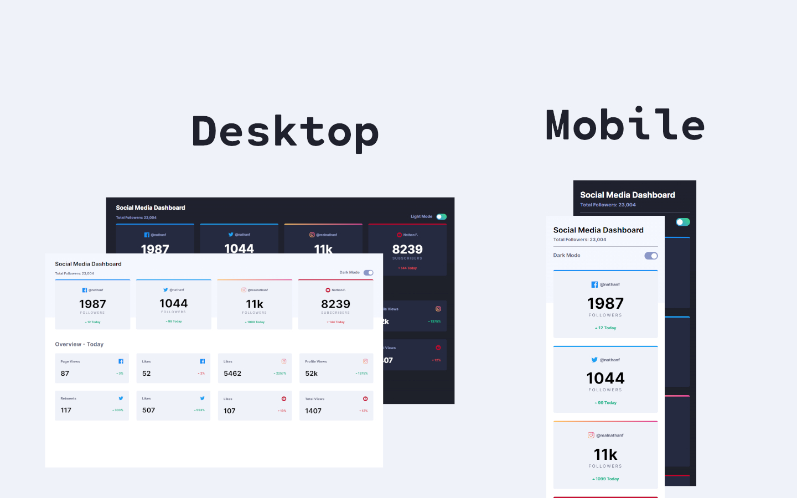

# Frontend Mentor - Social media dashboard with theme switcher solution

This is a solution to the [Social media dashboard with theme switcher challenge on Frontend Mentor](https://www.frontendmentor.io/challenges/social-media-dashboard-with-theme-switcher-6oY8ozp_H). Frontend Mentor challenges help you improve your coding skills by building realistic projects. 

## Table of contents

- [Overview](#overview)
  - [Screenshot](#screenshot)
  - [Links](#links)
- [My process](#my-process)
  - [Built with](#built-with)
  - [What I learned](#what-i-learned)
- [Author](#author)

## Overview

### Screenshot

### Links

- Solution URL: [Github](https://github.com/covolan/frontend-mentor1/edit/main/social-media-dashboard-with-theme-switcher-master/)
- Live Site URL: [Page](https://covolan.github.io/frontend-mentor1/social-media-dashboard-with-theme-switcher-master/)

## My process

### Built with

- Semantic HTML5 markup
- SCSS for style
- Vanilla JS for the scripts
- Mobile first approach

### What I learned

This challenge was a new experience for me, as I never before did a mobile first app. Was quite fun, I learned a lot doint it so. A lot of little challenges trough out the process of building the app. I ended up using the add and remove class approach in the script part. Also I used a open source script to add a hover animation in each of the displayed cards. Overall a unique experience, I will eventually go back to the mobile first approach when I see it fits. Thanks for [@muhammad-medhat](https://www.frontendmentor.io/profile/muhammad-medhat) pointed it out the mobile first approach in a past challenge!

## Author

- Github - [Covolan](https://github.com/covolan)
- Frontend Mentor - [@Covolan](https://www.frontendmentor.io/profile/covolan)
- LinkedIn - [@alexandre-covolan](https://www.linkedin.com/in/alexandre-covolan/)
