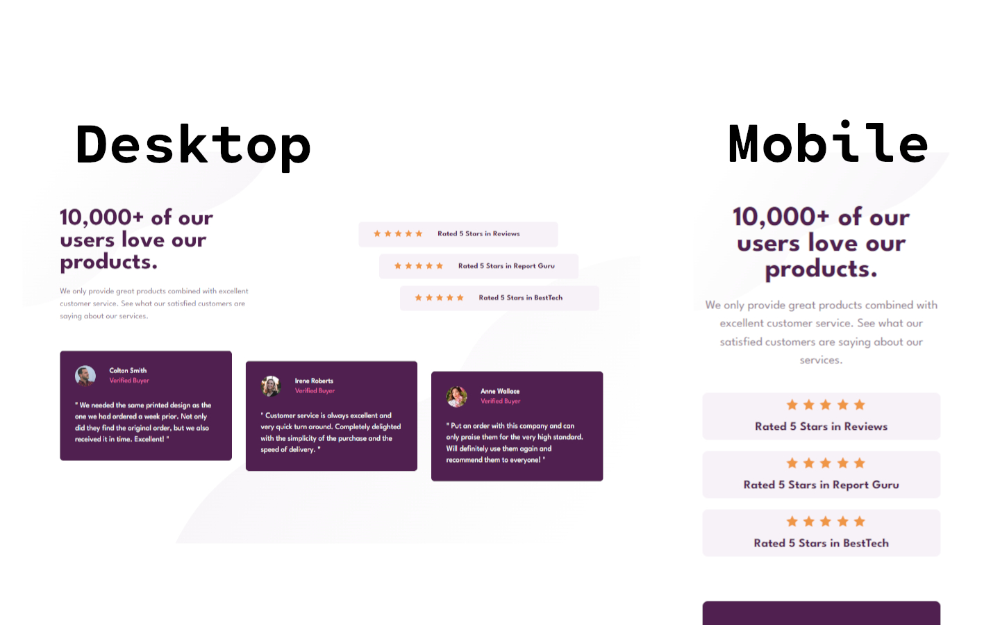

# Frontend Mentor - Social proof section solution

This is a solution to the [Social proof section challenge on Frontend Mentor](https://www.frontendmentor.io/challenges/social-proof-section-6e0qTv_bA). Frontend Mentor challenges help you improve your coding skills by building realistic projects.

## Table of contents

- [Overview](#overview)
  - [Screenshot](#screenshot)
  - [Links](#links)
- [My process](#my-process)
  - [Built with](#built-with)
  - [What I learned and thought process](#what-i-learned-and-thought-process)
  - [Continued development](#continued-development)
- [Author](#author)

## Overview

### Screenshot



### Links

- Solution URL: [Github](https://github.com/covolan/frontend-mentor1/edit/main/social-proof-section-master/)
- Live Site URL: [Page](https://covolan.github.io/frontend-mentor1/social-proof-section-master/index.html)

## My process

### Built with

- Semantic HTML5 markup
- SCSS

### What I learned and thought process

As aways the first step was semantically eddit the markup content. Also added the images that we will need for the project.

```html
<body>
  <main class="main">
    <div class="top-left-content">
      <h1>10,000+ of our users love our products.</h1>
      <p>
        We only provide great products combined with excellent customer service.
        See what our satisfied customers are saying about our services.
      </p>
    </div>

    <div class="top-right-content">
      <div class="star-card">
        <div>
          
          
          
          
          
        </div>
        <p>Rated 5 Stars in Reviews</p>
      </div>
      <div class="star-card">
        <div>
          
          
          
          
          
        </div>
        <p>Rated 5 Stars in Report Guru</p>
      </div>
      <div class="star-card">
        <div>
          
          
          
          
          
        </div>
        <p>Rated 5 Stars in BestTech</p>
      </div>
    </div>

    <div class="card-content">
      <div class="card">
        <div class="card-top">
          
          <ul>
            <li class="name">Colton Smith</li>
            <li class="legend">Verified Buyer</li>
          </ul>
        </div>
        <p>
          " We needed the same printed design as the one we had ordered a week
          prior. Not only did they find the original order, but we also received
          it in time. Excellent! "
        </p>
      </div>

      <div class="card">
        <div class="card-top">
          
          <ul>
            <li class="name">Irene Roberts</li>
            <li class="legend">Verified Buyer</li>
          </ul>
        </div>
        <p>
          " Customer service is always excellent and very quick turn around.
          Completely delighted with the simplicity of the purchase and the speed
          of delivery. "
        </p>
      </div>

      <div class="card">
        <div class="card-top">
          
          <ul>
            <li class="name">Anne Wallace</li>
            <li class="legend">Verified Buyer</li>
          </ul>
        </div>
        <p>
          " Put an order with this company and can only praise them for the very
          high standard. Will definitely use them again and recommend them to
          everyone! "
        </p>
      </div>
    </div>
  </main>
</body>
```

The first step into making the style file was naming the color variables and import the font aswell, then made de default margin and padding of the document being zero and the box-sizing border-box. As the document will use only one font. I then adjusted the body to center the content and have a viewheight of 100, also adjusted the background. Then made the main have a display of grid and gave it 2 columns.

```scss
$very-dark-magenta: hsl(300, 43%, 22%);
$soft-pink: hsl(333, 80%, 67%);
$dark-grayish-magenta: hsl(303, 10%, 53%);
$light-grayish-magenta: hsl(300, 24%, 96%);
$white: hsl(0, 0%, 100%);

@import url("https://fonts.googleapis.com/css2?family=League+Spartan:wght@400;500;700&display=swap");

* {
  margin: 0;
  padding: 0;
  box-sizing: border-box;
  font-family: "League Spartan", sans-serif;
}

body {
  display: flex;
  flex-direction: column;
  justify-content: center;
  align-items: center;
  min-height: 100vh;
  background-image: url(../images/bg-pattern-bottom-desktop.svg),
    url(../images/bg-pattern-top-desktop.svg);
  background-position: bottom right, top left;
  background-repeat: no-repeat;
}

.main {
  display: grid;
  grid-template-columns: 1fr 1fr;
  margin: 3em;
}
```

Then I begun to adjust the left content to match the design, pretty straight foward. Next was the right content, this time nedded a little bit of tweaking to proper match the intended design. To make the staircase effect I utilized :nth-child() property.

```scss
.top-left-content {
  max-width: 28em;
  h1 {
    font-size: 3.5em;
    margin-bottom: 0.5em;
    color: $very-dark-magenta;
  }
  p {
    line-height: 1.5em;
    color: $dark-grayish-magenta;
    font-size: 1.2em;
  }
}

.top-right-content {
  display: flex;
  flex-direction: column;
  gap: 1em;
  margin-top: 2em;
  margin-left: 10%;
  .star-card {
    display: flex;
    align-items: center;
    padding: 1.2em;
    background-color: $light-grayish-magenta;
    gap: 2em;
    max-width: 29em;
    border-radius: 0.5em;
    img {
      margin-right: 0.2em;
    }
    div {
      margin-left: 1em;
    }
    p {
      font-size: 1.1em;
      font-weight: 700;
      color: $very-dark-magenta;
    }
  }
  .star-card:nth-child(2) {
    margin-left: 3em;
  }

  .star-card:nth-child(3) {
    margin-left: 6em;
  }
}
```

The next step was adjusting the bottom cards, this took quite a bit of fine adjustment and testing. In this section I also utilized the :nth-child() to make the staircase effect.

```scss
.card-content {
  display: flex;
  flex-direction: row;
  gap: 2em;
  grid-column-start: 1;
  grid-column-end: 3;
  margin-top: 4em;
  min-height: 20em;
  .card {
    border-radius: 0.5em;
    max-width: 25em;
    max-height: 16em;
    background-color: $very-dark-magenta;
    color: $white;
    padding: 2.2em;
    .card-top {
      display: flex;
      align-items: center;
      gap: 2em;
      margin-bottom: 2em;
      img {
        width: 3em;
        height: auto;
        border-radius: 50%;
      }
      ul {
        list-style: none;
        .name {
          font-weight: 500;
          margin-bottom: 0.5em;
        }
        .legend {
          color: $soft-pink;
        }
      }
    }
    p {
      line-height: 1.5em;
      font-size: 1.1em;
    }
  }
  .card:nth-child(2) {
    margin-top: 1.5em;
  }
  .card:nth-child(3) {
    margin-top: 3em;
  }
}
```

The final step is making the layout responsive, for that I used the media queries. This media queries ended up beeing quite long for this project, I think there is a better way to do it, but that is the way that worked for me.

```scss
@media screen and (max-width: 1200px) and (min-width: 876px) {
  .card-content {
    gap: 1em;
    .card {
      max-height: 20em;
    }
  }
  .top-right-content {
    margin-left: 10%;
    .star-card {
      flex-direction: column;
      gap: 1em;
    }
    .star-card:nth-child(2) {
      margin-left: unset;
    }

    .star-card:nth-child(3) {
      margin-left: unset;
    }
  }
}

@media screen and (max-width: 875px) {
  body {
    overflow-x: hidden;
    background-image: url(../images/bg-pattern-bottom-mobile.svg),
      url(../images/bg-pattern-top-mobile.svg);
  }
  .main {
    grid-template-columns: 1fr;
    margin: 5em 1em;
  }

  .top-left-content {
    text-align: center;
    h1 {
      font-size: 2.5em;
    }
    p {
      font-size: 1.1em;
    }
  }

  .card-content {
    grid-column-start: unset;
    grid-column-end: unset;
    flex-direction: column;
    align-items: center;
    gap: 1.5em;
    .card {
      max-height: unset;
    }
    .card:nth-child(2) {
      margin-top: unset;
    }
    .card:nth-child(3) {
      margin-top: unset;
    }
  }

  .top-right-content {
    margin-left: unset;
    div {
      margin-left: unset;
    }
    .star-card {
      flex-direction: column;
      gap: 0.8em;
      padding: 0.6em;
    }
    .star-card:nth-child(2) {
      margin-left: unset;
    }

    .star-card:nth-child(3) {
      margin-left: unset;
    }
  }
}
```

### Continued development

For future projects I want to try reduce a bit the media queries.

## Author

- Github - [Covolan](https://github.com/covolan)
- Frontend Mentor - [@Covolan](https://www.frontendmentor.io/profile/covolan)
- LinkedIn - [@alexandre-covolan](https://www.linkedin.com/in/alexandre-covolan/)
