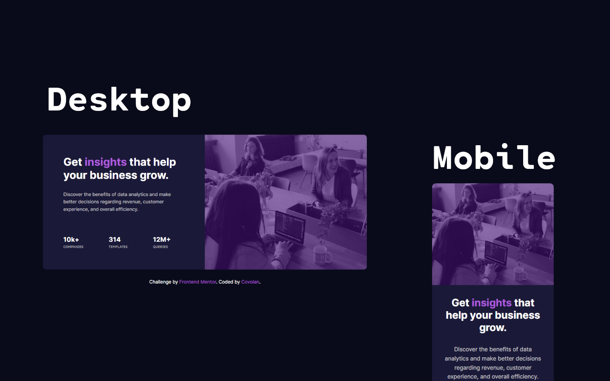

# Frontend Mentor - Stats preview card component solution

This is a solution to the [Stats preview card component challenge on Frontend Mentor](https://www.frontendmentor.io/challenges/stats-preview-card-component-8JqbgoU62). Frontend Mentor challenges help you improve your coding skills by building realistic projects.

## Table of contents

- [Overview](#overview)
  - [Screenshot](#screenshot)
  - [Links](#links)
- [My process](#my-process)
  - [Built with](#built-with)
  - [What I learned and thought process](#what-i-learned-and-thought-process)
  - [Continued development](#continued-development)
  - [Useful resources](#useful-resources)
- [Author](#author)

**Note: Delete this note and update the table of contents based on what sections you keep.**

## Overview

### Screenshot



### Links

- Solution URL: [GitHub]()
- Live Site URL: [Vercel]()

## My process

### Built with

- Semantic HTML5 markup
- SASS

### What I learned and thought process

To start this project I first tried to semantically tag every content of the provided html. Giving every content a meaning and a class for the css part.

```html
<body>
  <section class="main" role="main">
    <header class="header-img">
      
    </header>

    <section class="product">
      <h1>
        Get <span class="violet">insights</span> that help your business grow.
      </h1>

      <p id="product-presentation" class="description">
        Discover the benefits of data analytics and make better decisions
        regarding revenue, customer experience, and overall efficiency.
      </p>

      <section class="stats">
        <div>
          <span class="info-number">10k+</span> <br />
          <span class="info-description">companies</span>
        </div>
        <div>
          <span class="info-number">314</span> <br />
          <span class="info-description">templates</span>
        </div>
        <div>
          <span class="info-number">12M+</span> <br />
          <span class="info-description">queries</span>
        </div>
      </section>
    </section>
  </section>

  <div class="attribution" role="complementary">
    Challenge by
    <a href="https://www.frontendmentor.io?ref=challenge" target="_blank"
      >Frontend Mentor</a
    >. Coded by
    <a href="https://www.frontendmentor.io/profile/covolan" target="_blank"
      >Covolan</a
    >.
  </div>
</body>
```

Then I started giving the page the style to match the design. First I imported the fonts that would be used on the document, then created a variable for each color that would be used. Made a alteration to the whole document to set the default margin and padding to 0 and border-box also for box-sizing. Then adjust the body to center the content.

```scss
@import url("https://fonts.googleapis.com/css2?family=Inter:wght@400;700&family=Lexend+Deca&display=swap");

$very-dark-blue: hsl(233, 47%, 7%);
$dark-desaturated-blue: hsl(244, 38%, 16%);
$soft-violet: hsl(277, 64%, 61%);
$soft-violet2: hsl(277, 100%, 43%);

$white: hsl(0, 0%, 100%);
$slightly-transparent-white1: hsla(0, 0%, 100%, 0.75);
$slightly-transparent-white2: hsla(0, 0%, 100%, 0.6);

* {
  padding: 0;
  margin: 0;
  box-sizing: border-box;
}

body {
  background-color: $very-dark-blue;
  display: flex;
  flex-direction: column;
  justify-content: center;
  align-items: center;
  min-height: 100vh;
}
```

The next step was starting working on the main section. In order to split the content evenly, I created a grid display with 2 columns and one row. Giving the header-img a order of 2 made it come in the second column. also gave the product section a display of flex and column behavior. The filter for the image was a little tricky, I couldn't get the color quite right froom the design screenshot, but I made as close as possible. **Edit [Paweł Piotrowski](https://www.frontendmentor.io/profile/pawelpiotrowski38) from Frontend Mentor taught me how to do it properly: set the background of it's parent with the desired color, then use mix-blend-mode setted to multiply and lower the opacity of the image**

```scss
.main {
  display: grid;
  grid-template-columns: 1fr 1fr;
  grid-template-rows: 1fr;
  max-width: 69.375em;
  background-color: $dark-desaturated-blue;
  border-radius: 0.625em;
  margin: 1em;
  .header-img {
    order: 2;
    background-color: $soft-violet;
    img {
      width: 100%;
      height: 100%;
      // filter: opacity(40%) drop-shadow(0 0 $soft-violet2);
      mix-blend-mode: multiply;
      opacity: 0.75
      border-radius: 0 0.625em 0.625em 0;
    }
  }
  .product {
    display: flex;
    flex-direction: column;
    padding: 4.375em;
    font-family: "Inter", sans-serif;
  }
}
```

Then come the stylishing of the text content from the product section, pretty straight foward, the only thing that took a little more time was setting the stats right.

```scss
h1 {
  font-size: 2.3em;
  color: $white;
  .violet {
    color: $soft-violet;
  }
}
.description {
  color: $slightly-transparent-white1;
  font-size: 1em;
  padding: 2em 0;
  line-height: 1.6em;
}
.stats {
  margin-top: auto;
  display: flex;
  justify-content: space-between;
  color: $slightly-transparent-white2;
  max-width: 23em;
  .info-number {
    color: $white;
    font-weight: 700;
    font-size: 1.4em;
  }
  .info-description {
    font-family: "Lexend Deca", sans-serif;
    text-transform: uppercase;
    font-size: 0.7em;
  }
}
```

In this part I gave the provided footer some style to fit the design.

```scss
.attribution {
  font-size: 1em;
  color: $white;
  text-align: center;
  font-family: "Inter", sans-serif;
  margin: 1em;
}

.attribution a {
  color: $soft-violet;
  text-decoration: none;
  cursor: pointer;
}
```

The final step was making the media query for responsiveness. Pretty straight foward also. I reduced the padding from 870 to 720px, then made the mobile design starting at 720px. The tweeks that I made was basically transform the grid template to only one column, change the order of the image to start with it on the heading, adjust the borders and font-size and center the stats.

```scss
@media screen and (max-width: 870px) and (min-width: 720px) {
  .main {
    .product {
      padding: 2em;
    }
  }
}

@media screen and (max-width: 720px) {
  .main {
    grid-template-columns: 1fr;
    .header-img {
      order: 0;
      img {
        border-radius: 0.625em 0.625em 0 0;
      }
    }
    .product {
      padding: 2em;
      text-align: center;
      align-items: center;
      h1 {
        font-size: 1.8em;
      }
    }
    .stats {
      flex-direction: column;
      gap: 1em;
    }
  }
}
```

### Continued development

I believe that I could added more media queries to fit properly every device, but it would add quite a little bit of coding. For future projects I want to explore better the media queries.

### Useful resources

In this project I used the px to em converter [tool](https://www.w3schools.com/tags/ref_pxtoemconversion.asp) from w3schools.

## Author

- Github - [Covolan](https://github.com/covolan)
- Frontend Mentor - [@Covolan](https://www.frontendmentor.io/profile/covolan)
- LinkedIn - [@alexandre-covolan](https://www.linkedin.com/in/alexandre-covolan/)

